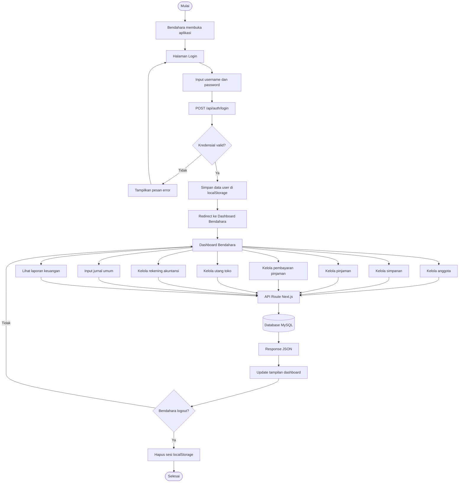
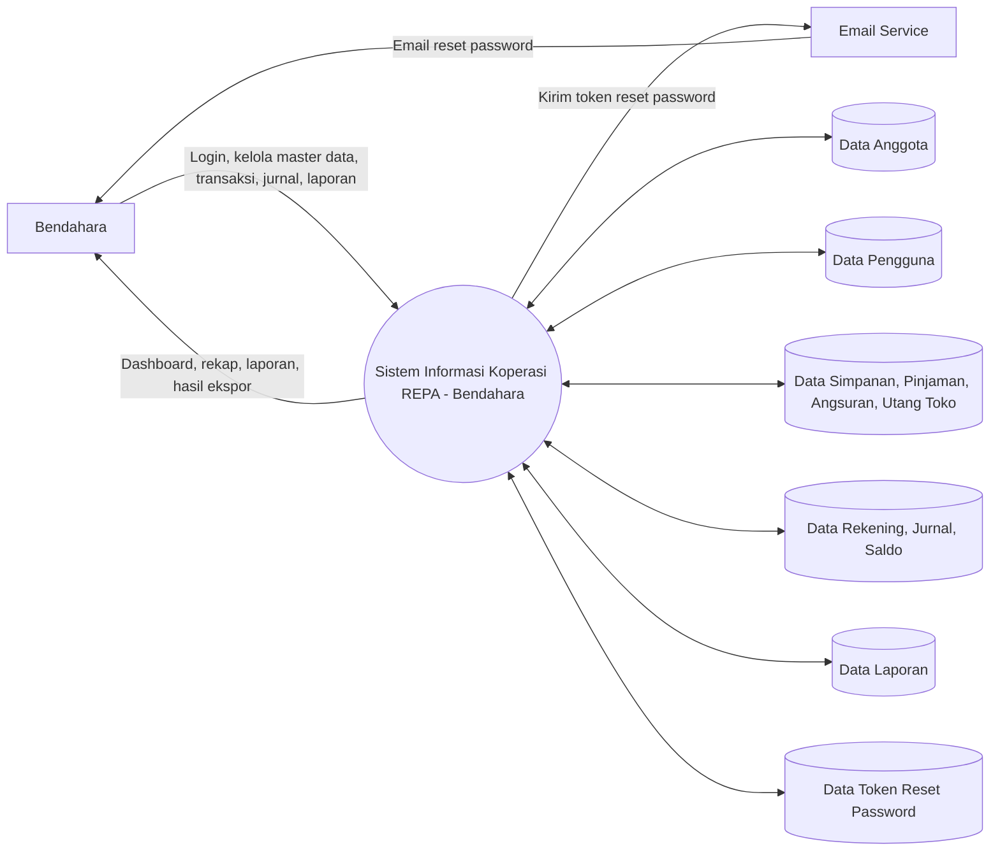
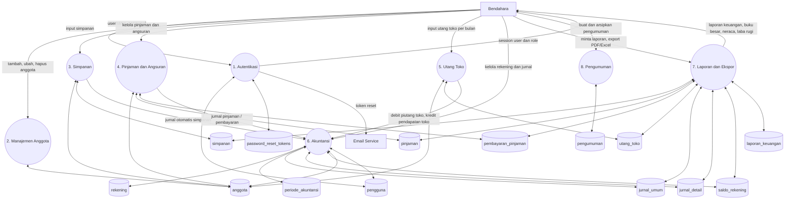
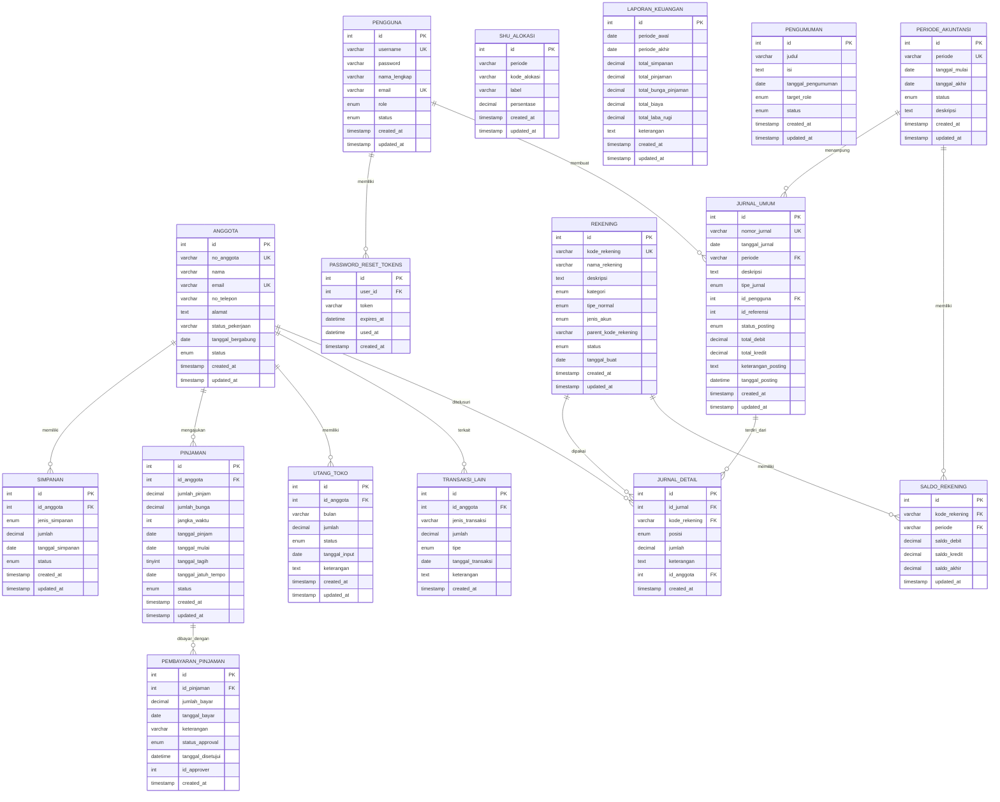

# Diagram Mermaid Sistem Koperasi REPA

File ini berisi flowchart, DFD, ERD, dan class diagram khusus role Bendahara dalam format Mermaid.
Untuk memasukkan ke draw.io: buka draw.io, pilih `Insert > Advanced > Mermaid`, lalu paste salah satu blok kode Mermaid di bawah.

## 1. Flowchart Sistem

## 2. DFD Level 0

## 3. DFD Level 1

## 4. ERD

## 5. Class Diagram

```mermaid
classDiagram
    class AuthService {
        +login(username, password)
        +register(data)
        +requestPasswordReset(email)
        +resetPassword(token, password)
    }

    class AnggotaService {
        +listAnggota()
        +createAnggota(data)
        +updateAnggota(id, data)
        +deleteAnggota(id)
        +getDetailAnggota(id)
    }

    class SimpananService {
        +listSimpanan(filter)
        +createSimpanan(data)
        +calculateTotalByAnggota(idAnggota)
    }

    class PinjamanService {
        +listPinjaman(filter)
        +createPinjamanAnggota(data)
        +updateStatus(id, status)
        +calculateJatuhTempo(tanggalMulai, jangkaWaktu)
    }

    class PembayaranPinjamanService {
        +listPembayaran(filter)
        +createPembayaran(data)
        +approvePembayaran(id, approverId)
        +calculateSisaPinjaman(idPinjaman)
    }

    class UtangTokoService {
        +listUtangToko(filter)
        +createUtangToko(data)
        +updateUtangToko(id, data)
        +deleteUtangToko(id)
        +createAccountingJournal(data)
    }

    class AccountingService {
        +listRekening()
        +createRekening(data)
        +postJournalEntry(entry)
        +addBalancedJournal(lines)
        +getLedger(filter)
        +getTrialBalance(periode)
        +getNeraca(periode)
        +getLabaRugi(periode)
    }

    class ReportService {
        +getDashboardStats()
        +getFinancialReport(filter)
        +exportPdf(data)
        +exportExcel(data)
    }

    class PengumumanService {
        +listPengumuman(role)
        +createPengumuman(data)
        +updatePengumuman(id, data)
        +archivePengumuman(id)
    }

    class DatabasePool {
        +getConnection()
        +query(sql, params)
        +beginTransaction()
        +commit()
        +rollback()
    }

    class Anggota {
        +int id
        +string noAnggota
        +string nama
        +string email
        +string noTelepon
        +string alamat
        +string statusPekerjaan
        +string status
    }

    class Pengguna {
        +int id
        +string username
        +string password
        +string namaLengkap
        +string email
        +string role
        +string status
    }

    class Simpanan {
        +int id
        +int idAnggota
        +string jenisSimpanan
        +number jumlah
        +date tanggalSimpanan
        +string status
    }

    class Pinjaman {
        +int id
        +int idAnggota
        +number jumlahPinjam
        +number jumlahBunga
        +int jangkaWaktu
        +date tanggalPinjam
        +date tanggalJatuhTempo
        +string status
    }

    class PembayaranPinjaman {
        +int id
        +int idPinjaman
        +number jumlahBayar
        +date tanggalBayar
        +string statusApproval
    }

    class UtangToko {
        +int id
        +int idAnggota
        +string bulan
        +number jumlah
        +string status
        +date tanggalInput
    }

    class Rekening {
        +int id
        +string kodeRekening
        +string namaRekening
        +string kategori
        +string tipeNormal
        +string status
    }

    class JurnalUmum {
        +int id
        +string nomorJurnal
        +date tanggalJurnal
        +string periode
        +string tipeJurnal
        +string statusPosting
        +number totalDebit
        +number totalKredit
    }

    class JurnalDetail {
        +int id
        +int idJurnal
        +string kodeRekening
        +string posisi
        +number jumlah
        +int idAnggota
    }

    AuthService --> DatabasePool
    AnggotaService --> DatabasePool
    SimpananService --> DatabasePool
    PinjamanService --> DatabasePool
    PembayaranPinjamanService --> DatabasePool
    UtangTokoService --> DatabasePool
    AccountingService --> DatabasePool
    ReportService --> DatabasePool
    PengumumanService --> DatabasePool

    AuthService ..> Pengguna
    AnggotaService ..> Anggota
    SimpananService ..> Simpanan
    PinjamanService ..> Pinjaman
    PembayaranPinjamanService ..> PembayaranPinjaman
    UtangTokoService ..> UtangToko
    UtangTokoService --> AccountingService
    AccountingService ..> Rekening
    AccountingService ..> JurnalUmum
    AccountingService ..> JurnalDetail
    ReportService --> AccountingService

    Anggota "1" --> "0..*" Simpanan
    Anggota "1" --> "0..*" Pinjaman
    Pinjaman "1" --> "0..*" PembayaranPinjaman
    Anggota "1" --> "0..*" UtangToko
    Pengguna "1" --> "0..*" JurnalUmum
    JurnalUmum "1" --> "2..*" JurnalDetail
    Rekening "1" --> "0..*" JurnalDetail
    Anggota "1" --> "0..*" JurnalDetail
```

